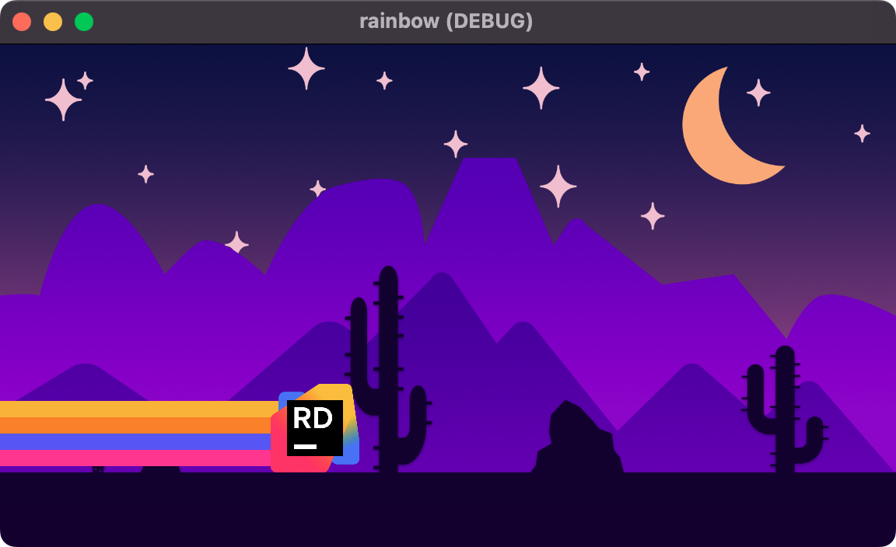

# Rainbow Trails in Godot 4

> Checkout [JetBrains Rider](https://jetbrains.com/rider) for your software development needs.

This repository holds a sample project showing how to create a dynamic rainbow trail that follows the player character. This visual is inspired by the classic game [Bit.Trip Runner](https://store.steampowered.com/app/63710/BITTRIP_RUNNER/).



**[Check out active gameplay here](./misc/gameplay.mp4)**

This demo utilizes a technique with `Line2D` nodes to draw points at the `top_level` so that each point exists in the top-level space. This allows points to trail off from their parent element.

This **GDScript** is the most important part of this project.

```gdscript
extends Node2D

var lines: Array[Line2D]

@export var max_points := 100

func _ready() -> void:
	for node in get_children():
		if node is Line2D:
			# allow each line to set position based in scene
			node.top_level = true
			# ignore the initial points because 
			# things are about to get really weird :)
			node.clear_points()
			lines.append(node)

func _physics_process(delta: float) -> void:
	var point = global_position
	for line in lines:
		line.add_point(point)
		if line.points.size() > max_points:
			line.remove_point(0)
```

This technique can be used in many 2D games for tire tracks, space laser trails, or wavy scarves.

Enjoy!
